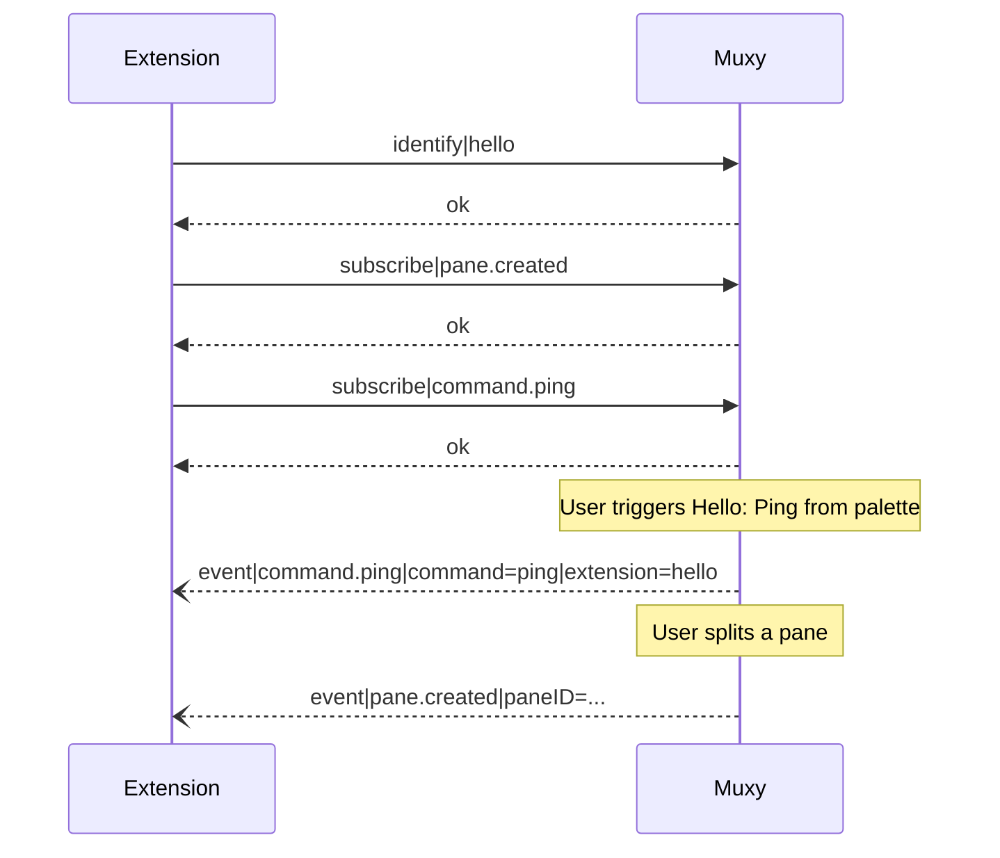

# Events

Extensions opt in to events by sending `subscribe|<event>` after `identify`. Subscribed events arrive on the same connection as `event|<name>|key=value|key=value...` lines.

## Handshake



The connection stays open for the lifetime of the extension subprocess. Muxy fans out matching events to every subscribed session.

## Identify rules

- `identify|<id>` is checked against the set of extensions currently loaded by `ExtensionStore`. Unknown IDs are rejected with `error:unknown extension <id>`.
- An extension may identify only once per connection. Subsequent `identify` lines overwrite the session's claimed ID.
- Sessions that never call `identify` (e.g. the `muxy` CLI) are treated as unidentified. They can still call verbs, but cannot subscribe to or be limited by manifest declarations.

## Subscribe rules

An identified extension can only subscribe to events that are either:

1. listed in its manifest `events` array, or
2. the event name of one of its own palette commands (`command.<id>` — auto-allowed; no `events` entry needed).

Anything else returns `error:event <name> not declared in manifest`.

When an extension is **reloaded** or **disabled**, every active session's `extensionID` is cleared and its subscriptions are re-filtered against the new manifest. Any in-flight subscription to an event no longer declared is dropped silently.

## Available events

All workspace events require the extension to list them in `manifest.events` before they can be subscribed. The `command.<id>` family is the one exception: an extension's own command events are auto-allowed (declaring the command in `manifest.commands` is implicit consent to receive its trigger).

| Event | Payload keys | Allowed by |
| --- | --- | --- |
| `pane.created` | `paneID` | `events: ["pane.created"]` |
| `pane.closed` | `paneID` | `events: ["pane.closed"]` |
| `pane.focused` | `projectID`, `worktreeID`, `areaID`, `tabID` | `events: ["pane.focused"]` |
| `tab.created` | `tabID` | `events: ["tab.created"]` |
| `tab.focused` | `areaID`, `tabID` | `events: ["tab.focused"]` |
| `project.switched` | `projectID` | `events: ["project.switched"]` |
| `worktree.switched` | `projectID`, `worktreeID` | `events: ["worktree.switched"]` |
| `notification.posted` | `paneID`, `projectID`, `tabID`, `title` | `events: ["notification.posted"]` |
| `command.<id>` | `command`, `extension` | Auto-allowed when `commands[].id == <id>` |

## Wire format

```
event|<name>|<key>=<value>|<key>=<value>
```

Keys are alphabetically sorted. Values have `|` and newlines stripped to keep the line parseable. UTF-8, newline-terminated. The full line — including the trailing `\n` — never exceeds 64 KiB; oversized payloads truncate sender-side.

## Event sources inside Muxy

- Workspace deltas (panes/tabs/projects/worktrees) are computed in `ExtensionEventEmitter` by snapshotting `AppState` before and after every `dispatch`.
- `notification.posted` is emitted from `NotificationStore` when a notification clears the focus filter.
- `command.<id>` is emitted from `ExtensionStore.triggerCommand` when the palette item is selected.

All sources route through `NotificationSocketServer.broadcast(event:)`, which fans out to any session whose `subscriptions` set contains the event name.
