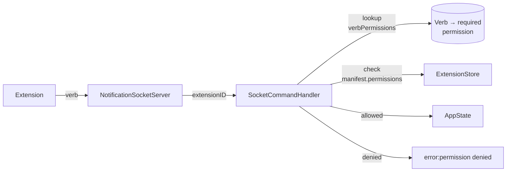

# Permissions

Permissions are declared in the manifest's `permissions` array and enforced at the socket boundary. If an extension calls a verb without the matching permission, the response is `error:permission denied (<perm>)`.

Permissions are not enforced for **unidentified** socket clients (e.g. the `muxy` CLI). They only apply once a session has run `identify|<extension-id>`.

## Available permissions

| Permission | Grants |
| --- | --- |
| `panes:read` | `read-screen`, `list-panes` |
| `panes:write` | `split-right`, `split-down`, `send`, `send-keys`, `close-pane`, `rename-pane` |
| `tabs:read` | `list-tabs` |
| `tabs:write` | `switch-tab`, `new-tab`, `next-tab`, `previous-tab` |
| `projects:read` | `list-projects` |
| `projects:write` | `switch-project` |
| `worktrees:read` | `list-worktrees` |
| `worktrees:write` | `create-worktree`, `switch-worktree`, `refresh-worktrees` |
| `notifications:write` | Post notifications via `type\|paneID\|title\|body` |

## Abuse handling

An identified extension that posts notifications without `notifications:write` has each attempt dropped and logged. After 100 dropped attempts on the same connection, the session is disconnected. The extension can reconnect, but the counter resets only on a new socket connection.

## What permissions don't gate

- **Subscribing to events** is gated separately by the manifest `events` array — see [Events](events.md). The connection's identity, not a `permissions` entry, decides what events it can subscribe to.
- **Receiving palette command triggers.** Once an extension declares a command in `commands`, it can subscribe to its own `command.<id>` event without listing it under `events`.
- **AI provider routing.** Declaring `aiProvider` in the manifest is enough; there is no separate permission today.

## Granularity & versioning

Permissions are coarse (verb groups, not individual verbs) on purpose: the API is in flux, and finer grain locks us into a wire format we may want to change. Expect this list to expand and possibly split (e.g. `panes:send` vs `panes:close`) once a dedicated extension API layer lands.
