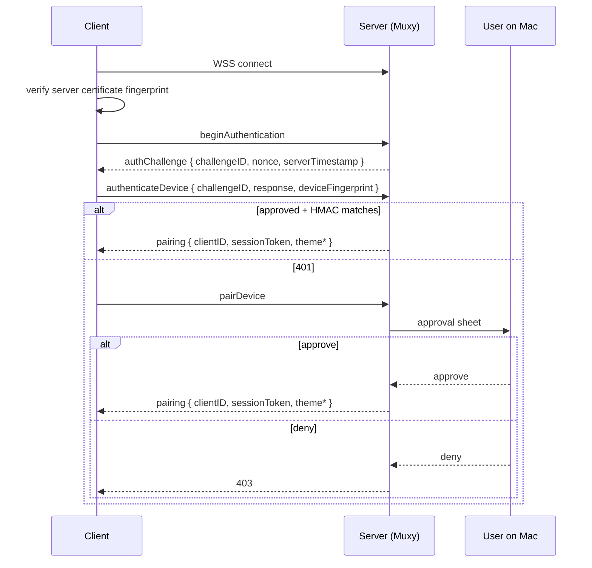

# Pairing & Authentication

Each client should generate and persist:

- `deviceID` — a stable UUID for that install
- `deviceName` — a user-friendly label
- `token` — a random secret persisted securely on the client

## Protocol versioning

Every top-level `MuxyMessage` envelope includes `protocolVersion`. If the field
is absent, the server treats the message as protocol version `1`.

The current protocol is version `2`. The server accepts versions `1` and `2`
during the v1 deprecation window. Successful handshake responses advertise the
accepted set through `acceptedVersions`.

## Connection flow

The QR/deep-link payload is a `muxy://pair` URI. It includes the host, port,
`transport=wss`, `protocolVersion=2`, and `certFingerprint`.



Client flow:

1. Scan the `muxy://pair` URI.
2. Connect to `wss://host:port`.
3. Verify the server certificate fingerprint equals `certFingerprint` from the URI.
4. Call `beginAuthentication`.
5. Reply with `authenticateDevice` challenge response.
6. Store the returned `sessionToken` for this WebSocket session.
7. Send `sessionToken` on every post-auth request.

Until authentication succeeds, every other API call returns `401 Authentication required`. After authentication succeeds, every post-auth request without the matching session token also returns `401`.

## `beginAuthentication`

Starts protocol v2 authentication for an approved device.

```json
{
  "type": "beginAuthentication",
  "value": {
    "deviceID": "2f8d1f9f-e065-4f62-af30-8c4b3d0bfc53",
    "deviceName": "Pixel 9",
    "deviceFingerprint": "client-install-fingerprint"
  }
}
```

Success result:

```json
{
  "type": "authChallenge",
  "value": {
    "challengeID": "64-hex-character-id",
    "nonce": "32-hex-character-nonce",
    "serverTimestamp": 1774000000000,
    "acceptedVersions": [1, 2]
  }
}
```

## `authenticateDevice`

Authenticates a previously approved device. Protocol v2 requires a challenge
response. Protocol v1 token auth remains accepted only during the deprecation
window.

For v2, compute the response as HMAC-SHA256 over:

```text
<nonce>
<serverTimestamp>
<deviceFingerprint>
```

Use the hex-decoded SHA-256 pairing token hash as the HMAC key, and send the
lowercase hex digest.

```json
{
  "type": "authenticateDevice",
  "value": {
    "deviceID": "2f8d1f9f-e065-4f62-af30-8c4b3d0bfc53",
    "deviceName": "Pixel 9",
    "challengeID": "64-hex-character-id",
    "response": "64-hex-character-hmac",
    "deviceFingerprint": "client-install-fingerprint"
  }
}
```

Success result:

```json
{
  "type": "pairing",
  "value": {
    "clientID": "62ea9d06-a1f4-4a11-9f39-33ee322f6573",
    "deviceName": "Pixel 9",
    "acceptedVersions": [1, 2],
    "sessionToken": "64-hex-character-session-token",
    "themeFg": 16777215,
    "themeBg": 197379,
    "themePalette": [0, 16711680, 65280]
  }
}
```

`sessionToken`, `themeFg`, `themeBg`, and `themePalette` are optional for
legacy payload compatibility. `acceptedVersions` defaults to `[1, 2]` on this
server when omitted.

Legacy v1 token auth uses the previous request shape:

```json
{
  "type": "authenticateDevice",
  "value": {
    "deviceID": "2f8d1f9f-e065-4f62-af30-8c4b3d0bfc53",
    "deviceName": "Pixel 9",
    "token": "random-secret-token"
  }
}
```

## `pairDevice`

Same request shape as the legacy token auth request. Triggers the approval sheet
on the Mac. The response is the same `pairing` result on success and includes a
session token.

## `registerDevice`

Registers a transient session for a device that has not persisted credentials. Returns a `deviceInfo` result with the same fields as `pairing`.

```json
{
  "type": "registerDevice",
  "value": {
    "deviceName": "Pixel 9"
  }
}
```

## Token mismatch

A token mismatch or invalid challenge response is treated as denied or
unauthorized. Re-pair from the client to recover.

## Revocation

The Mac's **Settings → Mobile** lists approved devices. Revoking removes the device from `approved-devices.json` and terminates any active connection for that `deviceID`.
