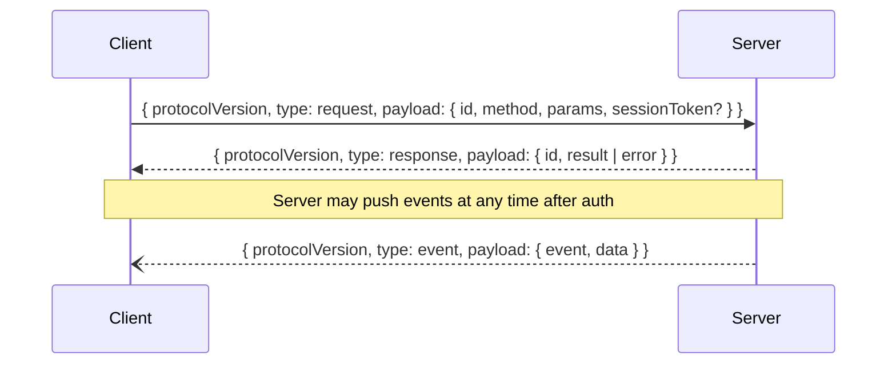

# Protocol

Every WebSocket frame is a JSON object with a top-level `type` field. Three types: `request`, `response`, `event`.



## Versioning

Protocol version `2` is current. Version `1` is accepted during the DEC-009
deprecation window so older companions can migrate.

If `protocolVersion` is absent, the server treats the envelope as version `1`.
New clients should always send `protocolVersion: 2`.

## Request envelope

```json
{
  "protocolVersion": 2,
  "type": "request",
  "payload": {
    "id": "request-id",
    "method": "listProjects",
    "params": null,
    "sessionToken": "64-hex-character-session-token"
  }
}
```

Rules:

- `id` is unique per in-flight request.
- `method` identifies the API operation.
- `params.type` must match `method` when params are present.
- Methods without parameters may send `params: null`.
- Auth methods omit `sessionToken`. Every post-auth method must include the
  session token returned by `pairing`.

Example with params:

```json
{
  "protocolVersion": 2,
  "type": "request",
  "payload": {
    "id": "req-1",
    "method": "getWorkspace",
    "params": {
      "type": "getWorkspace",
      "value": {
        "projectID": "9b84c9a0-1d55-4c64-bbf6-ef59ee02fa09"
      }
    },
    "sessionToken": "64-hex-character-session-token"
  }
}
```

## Authentication

### `beginAuthentication`

`beginAuthentication` starts protocol v2 authentication and is allowed before
the client is authenticated.

Params:

```json
{
  "type": "beginAuthentication",
  "value": {
    "deviceID": "2f8d1f9f-e065-4f62-af30-8c4b3d0bfc53",
    "deviceName": "Pixel 9",
    "deviceFingerprint": "client-install-fingerprint"
  }
}
```

Result:

```json
{
  "type": "authChallenge",
  "value": {
    "challengeID": "64-hex-character-id",
    "nonce": "32-hex-character-nonce",
    "serverTimestamp": 1774000000000,
    "acceptedVersions": [1, 2]
  }
}
```

Challenges expire after 30 seconds. A challenge is removed when consumed, so
replaying the same `challengeID` fails.

### `authenticateDevice`

Protocol v2 request:

```json
{
  "type": "authenticateDevice",
  "value": {
    "deviceID": "2f8d1f9f-e065-4f62-af30-8c4b3d0bfc53",
    "deviceName": "Pixel 9",
    "challengeID": "64-hex-character-id",
    "response": "64-hex-character-hmac",
    "deviceFingerprint": "client-install-fingerprint"
  }
}
```

The HMAC input is:

```text
<nonce>
<serverTimestamp>
<deviceFingerprint>
```

The HMAC key is the hex-decoded SHA-256 pairing token hash. The response is a
lowercase HMAC-SHA256 hex string.

Protocol v1 token auth remains accepted during the deprecation window:

```json
{
  "type": "authenticateDevice",
  "value": {
    "deviceID": "2f8d1f9f-e065-4f62-af30-8c4b3d0bfc53",
    "deviceName": "Pixel 9",
    "token": "random-secret-token"
  }
}
```

Protocol v2 token-only `authenticateDevice` requests return `400 Invalid parameters`.

Successful authentication returns:

```json
{
  "type": "pairing",
  "value": {
    "clientID": "62ea9d06-a1f4-4a11-9f39-33ee322f6573",
    "deviceName": "Pixel 9",
    "acceptedVersions": [1, 2],
    "sessionToken": "64-hex-character-session-token",
    "capabilities": ["project.read", "terminal.view", "terminal.input", "vcs.read", "vcs.write", "vcs.destructive"]
  }
}
```

`sessionToken` is scoped to the current WebSocket session. Clients must not use
it as a long-lived device credential.

## Capabilities

Every approved device has a set of remote capability scopes. Existing approved
devices and newly approved devices default to all non-admin scopes:

- `project.read`
- `terminal.view`
- `terminal.input`
- `vcs.read`
- `vcs.write`
- `vcs.destructive`

`admin` is reserved and is not granted by default.

The server checks capabilities after authentication and session-token validation,
before dispatching any post-auth RPC. Missing capabilities return `401
Authentication required`; clients should treat this as an authorization failure
for that method unless the device has been reconfigured and reconnected.

Capability mapping:

| Capability | Methods and events |
| --- | --- |
| `project.read` | Project/worktree/workspace navigation, tab/layout mutations, project logos, notifications, subscribe/unsubscribe, `registerDevice`, `workspaceChanged`, `projectsChanged`, `notificationReceived`, `themeChanged` |
| `terminal.view` | `getTerminalContent`, `terminalOutput`, `terminalSnapshot`, `paneOwnershipChanged` |
| `terminal.input` | `takeOverPane`, `releasePane`, `terminalInput`, `terminalResize`, `terminalScroll` |
| `vcs.read` | `getVCSStatus`, `vcsRefresh`, `vcsListBranches`, `vcsGetDiff` |
| `vcs.write` | `vcsStageFiles`, `vcsUnstageFiles`, `vcsSwitchBranch`, `vcsCreateBranch`, `vcsCreatePR`, `vcsAddWorktree` |
| `vcs.destructive` | `vcsCommit`, `vcsPush`, `vcsPull`, `vcsDiscardFiles`, `vcsMergePullRequest`, `vcsRemoveWorktree` |

The first `vcs.destructive` call in a WebSocket session also requires local
confirmation on the Mac. If the operator denies the confirmation, the server
returns `403 Permission denied` and does not dispatch the RPC. If the operator
approves, destructive remote VCS calls are allowed for that WebSocket session
until disconnect.

## Remote audit log

Muxy writes every destructive remote VCS attempt to an append-only JSON Lines
file at `~/Library/Application Support/Muxy/audit/remote.log`. The log rotates
at 10 MB and keeps five rotated files.

Each record includes the timestamp, client ID, device ID, device name when
known, method, project ID, argument summary, outcome, optional error message,
and nullable `nonce` / `serverTimestamp` fields. Outcomes are `succeeded`,
`denied`, or `failed`. Denials are recorded when local destructive-action
confirmation is rejected before dispatch.

The app shows recent records in Settings -> Mobile -> Remote Audit Log. The
settings view is read-only; the JSON Lines file remains the durable record for
external inspection.

## Response envelope

Success:

```json
{
  "protocolVersion": 2,
  "type": "response",
  "payload": {
    "id": "request-id",
    "result": { "type": "ok" }
  }
}
```

Failure:

```json
{
  "protocolVersion": 2,
  "type": "response",
  "payload": {
    "id": "request-id",
    "error": { "code": 401, "message": "Authentication required" }
  }
}
```

Only one of `result` or `error` is present; the unused field is omitted.

## Event envelope

```json
{
  "protocolVersion": 2,
  "type": "event",
  "payload": {
    "event": "workspaceChanged",
    "data": {
      "type": "workspace",
      "value": { "projectID": "…", "worktreeID": "…", "focusedAreaID": "…", "root": { "type": "tabArea", "tabArea": { … } } }
    }
  }
}
```

See [Events](events.md) for the full list of pushed events and their data types.
